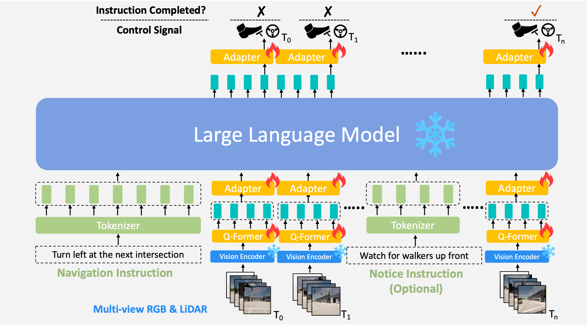

# LMDrive: Closed-Loop End-to-End Driving with Large Language Models
*An end-to-end, closed-loop, language-based autonomous driving framework, which interacts with the dynamic environment via multi-modal multi-view sensor data and natural language instructions.*

[[Project Page](https://hao-shao.com/projects/lmdrive.html)] [[Paper](https://arxiv.org/abs/2312.07488)]  [[Dataset(hugging face)](https://huggingface.co/datasets/OpenDILabCommunity/LMDrive)]  [[Model Zoo](https://huggingface.co/collections/OpenDILabCommunity/lmdrive-658aee50ce38d143c4925a98)]

[[Dataset(OpenXlab)](https://openxlab.org.cn/datasets/deepcs233/LMDrive)]
[[Model Zoo(OpenXLab)](https://openxlab.org.cn/models/detail/deepcs233/LMDrive)]


[](https://hits.seeyoufarm.com)
[](https://github.com/tatsu-lab/stanford_alpaca/blob/main/LICENSE)
[](https://github.com/tatsu-lab/stanford_alpaca/blob/main/DATA_LICENSE)

## News

- `[02/27]` [LMDrive](https://arxiv.org/abs/2312.07488) is accepted by CVPR 2024 🎉🎉🎉
- `[01/25]` We uploaded our models to [OpenXLab](https://openxlab.org.cn/models/detail/deepcs233/LMDrive)
- `[01/23]` We gave a talk at [ZhiDongXi (智东西)](https://wqpoq.xetslk.com/sl/3D1aRZ)
- `[01/20]` We uploaded our dataset to [OpenXLab](https://openxlab.org.cn/datasets/deepcs233/LMDrive)
- `[12/21]` We released our project website [here](https://hao-shao.com/projects/lmdrive.html)

****

<div align="center">
  </img>
</div>

> [Hao Shao](http://hao-shao.com/), Yuxuan Hu, [Letian Wang](https://letianwang0.wixsite.com/myhome), [Steven L. Waslander](https://www.trailab.utias.utoronto.ca/stevenwaslander), [Yu Liu](https://liuyu.us/), [Hongsheng Li](http://www.ee.cuhk.edu.hk/~hsli/).

This repository contains code for the paper [LMDrive: Closed-Loop End-to-End Driving with Large Language Models](https://arxiv.org/abs/2312.07488). This work proposes a novel language-guided, end-to-end, closed-loop autonomous driving framework.

## Demo Video


<div align="center">
  <video width="800" src="https://github.com/opendilab/LMDrive/assets/17512647/65b2785d-e8bc-4ec1-ac86-e077299a465d"></video>
</div>

## Contents
1. [Setup](#setup)
2. [Model Weights](#lmdrive-Weights)
3. [Dataset](#dataset)
      1. [Overview](#overview)
      1. [Data Generation](#data-generation)
      2. [Data Pre-procession](#data-pre-procession)
      3. [Data Parsing](#data-parsing)
4. [Training](#training)
      1. [Vision encoder pre-training](#vision-encoder-pre-training)
      2. [Instruction finetuning](#instruction-finetuning)
5. [Evaluation](#evaluation)
6. [Citation](#citation)
7. [Acknowledgements](#acknowledgements)

## Setup

Our project is built on three parts: (1) vision encoder (corresponding repo: timm); (2) vision LLM (corresponding repo: LAVIS); (3) data collection, agent controller (corresponding repo: InterFuser, Leaderboard, ScenarioRunner). 

Install anaconda
```Shell
wget https://repo.anaconda.com/archive/Anaconda3-2020.11-Linux-x86_64.sh
bash Anaconda3-2020.11-Linux-x86_64.sh
source ~/.bashrc
```

Clone the repo and build the environment

```Shell
git clone https://github.com/opendilab/LMDrive.git
cd LMDrive
conda create -n lmdrive python=3.8
conda activate lmdrive
cd vision_encoder
pip3 install -r requirements.txt
python setup.py develop # if you have installed timm before, please uninstall it
cd ../LAVIS
pip3 install -r requirements.txt
python setup.py develop # if you have installed LAVIS before, please uninstall it

pip install flash-attn --no-build-isolation # optional
```

Download and setup CARLA 0.9.10.1
```Shell
chmod +x setup_carla.sh
./setup_carla.sh
pip install carla
```

> If you encounter some problems related to Carla, please refer to [Carla Issues](https://github.com/carla-simulator/carla/issues) and [InterFuser Issues](https://github.com/opendilab/InterFuser) first.


## LMDrive Weights
If you are interested in including any other details in Model Zoo, please open an issue :)


| Version | Size |  Checkpoint | VisionEncoder | LLM-base | DS (LangAuto) | DS (LangAuto-short) |
|---------|------|------------|----------------|-----------|:---:|:---:|
| LMDrive-1.0 (LLaVA-v1.5-7B) | 7B |  [LMDrive-llava-v1.5-7b-v1.0](https://huggingface.co/OpenDILabCommunity/LMDrive-llava-v1.5-7b-v1.0) | [R50](https://huggingface.co/OpenDILabCommunity/LMDrive-vision-encoder-r50-v1.0) | [LLaVA-v1.5-7B](https://huggingface.co/liuhaotian/llava-v1.5-7b) | 36.2 | 50.6|
| LMDrive-1.0 (Vicuna-v1.5-7B) | 7B |  [LMDrive-vicuna-v1.5-7b-v1.0](https://huggingface.co/OpenDILabCommunity/LMDrive-vicuna-v1.5-7b-v1.0) | [R50](https://huggingface.co/OpenDILabCommunity/LMDrive-vision-encoder-r50-v1.0) | [Vicuna-v1.5-7B](https://huggingface.co/lmsys/vicuna-7b-v1.5-16k) | 33.5 | 45.3 |
| LMDrive-1.0 (LLaMA-7B) | 7B |  [LMDrive-llama-7b-v1.0](https://huggingface.co/OpenDILabCommunity/LMDrive-llama-7b-v1.0) | [R50](https://huggingface.co/OpenDILabCommunity/LMDrive-vision-encoder-r50-v1.0) | [LLaMA-7B](https://huggingface.co/huggyllama/llama-7b) | 31.3 | 42.8 |

*DS denotes the driving score*

## Dataset

We aim to develop an intelligent driving agent that can generate driving actions based on three sources of input: 1) sensor data (multi-view camera and LiDAR), so that the agent can generate actions that are aware of and compliant with the current scene; 2) navigation instructions (e.g. lane changing, turning), so that the agent can drive to meet the requirement in natural language (instruction from humans or navigation software); and 3) human notice instruction, so that the agent can interact with humans and adapt to human's suggestions and preferences (e.g. pay attention to adversarial events, deal with long-tail events, etc).

We provide a dataset with about 64K data clips, where each clip includes one navigation instruction, several notice instructions, a sequence of multi-modal multi-view sensor data, and control signals. The duration of the clip spans from 2 to 20 seconds. The dataset used in our paper can be downloaded [here](https://huggingface.co/datasets/OpenDILabCommunity/LMDrive). If you want to create your own dataset, please follow the steps we've outlined below.

### Overview
The data is generated with ```leaderboard/team_code/auto_pilot.py``` in 8 CARLA towns using the routes and scenarios files provided at ```leaderboard/data``` on CARLA 0.9.10.1 . The dataset is collected at a high frequency (~10Hz).

Once you have downloaded our dataset or collected your own dataset, it's necessary to systematically organize the data as follows. DATASET_ROOT is the root directory where your dataset is stored.

```
├── $DATASET_ROOT
│   └── dataset_index.txt  # for vision encoder pretraining
│   └── navigation_instruction_list.txt  # for instruction finetuning
│   └── notice_instruction_list.json  # for instruction finetuning
│   └── routes_town06_long_w7_11_28_18_28_35  #  data folder
│   └── routes_town01_short_w2_11_16_08_27_10
│   └── routes_town02_short_w2_11_16_22_55_25
│   └── routes_town01_short_w2_11_16_11_44_08 
      ├── rgb_full
      ├── lidar
      └── ...
```

The `navigation_instruction_list.txt` and `notice_instruction_list.txt` can be generated with our scripts by the data parsing [scripts](#data-parsing).
Each subfolder in the dataset you've collected should be structured as follows:

```
- routes_town(town_id)_{tiny,short,long}_w(weather_id)_timestamp: corresponding to different towns and routes files
    - routes_X: contains data for an individual route
        - rgb_full: a big multi-view camera image at 400x1200 resolution, which can be split into four images (left, center, right, rear)
        - lidar: 3d point cloud in .npy format. It only includes the LiDAR points captured in 1/20 second, covering 180 degrees of horizontal view. So if you want to utilize 360 degrees of view, you need to merge it with the data from lidar_odd.
        - lidar_odd: 3d point cloud in .npy format.
        - birdview: topdown segmentation images, LAV and LBC used this type of data for training
        - topdown: similar to birdview but it's captured by the down-facing camera
        - 3d_bbs: 3d bounding boxes for different agents
        - affordances: different types of affordances
        - actors_data: contains the positions, velocities and other metadata of surrounding vehicles and the traffic lights
        - measurements: contains ego agent's position, velocity, future waypoints, and other metadata
        - measurements_full: merges measurement and actors_data
        - measurements_all.json: merges the files in measurement_full into a single file
```
The `$DATASET_ROOT` directory must contain a file named `dataset_index.txt`, which can be generated by our data pre-processing [script](#data-pre-procession). It should list the training and evaluation data in the following format:

```
<relative_route_path_dir> <num_data_frames_in_this_dir>
routes_town06_long_w7_11_28_18_28_35/ 1062
routes_town01_short_w2_11_16_08_27_10/ 1785
routes_town01_short_w2_11_16_09_55_05/ 918
routes_town02_short_w2_11_16_22_55_25/ 134
routes_town01_short_w2_11_16_11_44_08/ 569
```

Here, `<relative_route_path_dir>` should be a relative path to the `$DATASET_ROOT`. The training code will concatenate the `$DATASET_ROOT` and `<relative_route_path_dir>` to create the full path for loading the data. 
In this format, 1062 represents the number of frames in the routes_town06_long_w7_11_28_18_28_35/rgb_full directory or routes_town06_long_w7_11_28_18_28_35/lidar, etc.

### Data Generation
#### Data Generation with multiple CARLA Servers
In addition to the dataset, we have also provided all the scripts used for generating data and these can be modified as required for different CARLA versions. The dataset is collected by a rule-based expert agent in different weathers and towns.

##### Running CARLA Servers
```bash
# Start 4 carla servers: ip [localhost], port [2000, 2002, 2004, 2006]. You can adjust the number of CARLA servers according to your situation and more servers can collect more data. If you use N servers to collect data, it means you have collected data N times on each route, except that the weather and traffic scenarios are random each time.

cd carla
CUDA_VISIBLE_DEVICES=0 ./CarlaUE4.sh --world-port=2000 -opengl &
CUDA_VISIBLE_DEVICES=1 ./CarlaUE4.sh --world-port=2002 -opengl &
CUDA_VISIBLE_DEVICES=2 ./CarlaUE4.sh --world-port=2004 -opengl &
CUDA_VISIBLE_DEVICES=3 ./CarlaUE4.sh --world-port=2006 -opengl &
```

Instructions for setting up docker are available [here](https://docs.nvidia.com/datacenter/cloud-native/container-toolkit/install-guide.html#docker). Pull the docker image of CARLA 0.9.10.1 ```docker pull carlasim/carla:0.9.10.1```.

Docker 18:
```
docker run -it --rm -p 2000-2002:2000-2002 --runtime=nvidia -e NVIDIA_VISIBLE_DEVICES=0 carlasim/carla:0.9.10.1 ./CarlaUE4.sh --world-port=2000 -opengl
```

Docker 19:
```Shell
docker run -it --rm --net=host --gpus '"device=0"' carlasim/carla:0.9.10.1 ./CarlaUE4.sh --world-port=2000 -opengl
```

If the docker container doesn't start properly then add another environment variable ```-e SDL_AUDIODRIVER=dsp```.

##### Run the Autopilot
Generate scripts for collecting data in batches.
```bash
cd dataset
python init_dir.py
cd ..
cd data_collection

# You can modify FPS, waypoints distribution strength in auto_agent.yaml ...

# If you do not use 4 servers, the following Python scripts are needed to modify
python generate_bashs.py
python generate_batch_collect.py 
cd ..
```

Run batch-run scripts of the town and route type that you need to collect.
```bash
bash data_collection/batch_run/run_route_routes_town01_long.sh
bash data_collection/batch_run/run_route_routes_town01_short.sh
...
bash data_collection/batch_run/run_route_routes_town07_tiny.sh
...
bash data_collection/batch_run/run_route_routes_town10_tiny.sh
```

**Note:** Our scripts will use a random weather condition for data collection

##### Data Generation with a single CARLA Server
With a single CARLA server, roll out the autopilot to start data generation.
```Shell
carla/CarlaUE4.sh --world-port=2000 -opengl
./leaderboard/scripts/run_evaluation.sh
```
The expert agent used for data generation is defined in ```leaderboard/team_code/auto_pilot.py```. Different variables which need to be set are specified in ```leaderboard/scripts/run_evaluation.sh```. 

### Data Pre-procession
We provide some Python scripts for pre-processing the collected data in `tools/data_preprocessing`, some of them are optional. Please execute them **in the order**:
1. `python get_list_file.py $DATASET_ROOT`: obtain the dataset_list.txt.
2. `python batch_merge_data.py $DATASET_ROOT`: merge several scattered data files into one file to reduce IO time when training. **[Optional]**
3. `python batch_rm_rgb_data.py $DATASET_ROOT`: delete redundant files after we have merged them into new files. **[Optional]**
4. `python batch_stat_blocked_data.py $DATASET_ROOT`: find the frames that the ego-vehicle is blocked for a long time. By removing them, we can enhance data distribution and decrease the overall data size.
5. `python batch_rm_blocked_data.py $DATASET_ROOT`: delete the blocked frames.
6. `python batch_recollect_data.py $DATASET_ROOT`: since we have removed some frames, we need to reorganize them to ensure that the frame ids are continuous. 
7. `python batch_merge_measurements.py $DATASET_ROOT`: merge the measurement files from all frames in one route folder to reduce IO time

### Data Parsing
After collecting and pre-processing the data, we need to parse the navigation instructions and notice instructions data with some Python scripts in `tools/data_parsing`.

The script for parsing navigation instructions:
```bash
python3 parse_instruction.py $DATSET_ROOT 
```

The parsed navigation clips will be saved in `$DATSET_ROOT/navigation_instruction_list.txt`, under the root directory of the dataset.


The script for parsing notice instructions:
```bash
python3 parse_notice.py $DATSET_ROOT 
```

The parsed notice clips will be saved in  `$DATSET_ROOT/notice_instruction_list.txt`.


The script for parsing misleading instructions:
```bash
python3 parse_misleading.py $DATSET_ROOT 
```

The parsed misleading clips will be saved in `$DATSET_ROOT/misleading_data.txt`.


## Training

LMDrive's training consists of two stages: 1) the vision encoder pre-training stage, to generate visual tokens from sensor inputs; and 2) the instruction-finetuning stage, to align the instruction/vision and control signal. 

LMDrive is trained on 8 A100 GPUs with 80GB memory (the first stage can be trained on GPUS with 32G memory). To train on fewer GPUs, you can reduce the `batch-size` and the `learning-rate` while maintaining their proportion.
Please download the multi-modal dataset with instructions collected in the CARLA simulator we use in the paper [here](https://huggingface.co/datasets/OpenDILabCommunity/LMDrive) or [openxlab (uploading)](https://openxlab.org.cn/datasets/deepcs233/LMDrive)], if you do not collect the dataset by yourself. You can only download part of them to verify our framework or your improvement.

    
### Vision encoder pre-training

Pretrain takes around 2~3 days for the visual encoder on 8x A100 (80G). Once the training is completed, you can locate the checkpoint of the vision encoder in the `output/` directory.

```bash
cd vision_encoder
bash scripts/train.sh
```

Some options to note:

- `GPU_NUM`:  the number of GPUs you want to use. By default, it is set to 8.
- `DATASET_ROOT`: the root directory for storing the dataset.
- `--model`: the structure of visual model. You can choose memfuser_baseline_e1d3_r26 which replaces ResNet50 with ResNet26. It's also possible to create new model variants in `visual_encoder/timm/models/memfuser.py`
- `--train-towns/train-weathers`: the data filter for the training dataset. Similarly, there are corresponding options, `val-towns/val-weathers` to filter the validation dataset accordingly.

### Instruction finetuning 

Instruction finetuning takes around 2~3 days for the visual encoder on 8x A100 (80G). Once the training is completed, you can locate the checkpoint of the adapter and qformer in the `lavis/output/` directory.

```bash
cd LAVIS
bash run.sh 8 lavis/projects/lmdrive/notice_llava15_visual_encoder_r50_seq40.yaml # 8 is the GPU number
```

Some options in the config.yaml to note:

- `preception_model`:  the model architecture of the vision encoder.
- `preception_model_ckpt`: the checkpoint path of the vision encoder.
- `llm_model`: the checkpoint path of the llm (Vicuna/LLaVA).
- `use_notice_prompt`: whether to use notice instruction data when training.
- `split_section_num_for_visual_encoder`: the number of sections the frames are divided into during the forward encoding of visual features. Higher values can save more memory, and it needs to be a factor of `token_max_length`.
- **datasets:**
  - `storage`: the root directory for storing the dataset.
  - `towns/weathers`: the data filter for training/evaluating.
  - `token_max_length`: the maximum number of frames, if the number of frames exceeds this value, they will be truncated.
  - `sample_interval`: the interval at which frames are sampled.

## Evaluation
Start a CARLA server (described above) and run the required agent. The adequate routes and scenarios files are provided in ```leaderboard/data``` and the required variables need to be set in ```leaderboard/scripts/run_evaluation.sh```.

Some options need to be updated in the `leaderboard/team_code/lmdrive_config.py`:
- `preception_model`:  the model architecture of the vision encoder.
- `preception_model_ckpt`: the checkpoint path of the vision encoder (obtained in the vision encoder pretraining stage).
- `llm_model`: the checkpoint path of the llm (LLaMA/Vicuna/LLaVA).
- `lmdrive_ckpt`: the checkpoint path of the lmdrive (obtained in the instruction finetuing stage).

Update ```leaderboard/scripts/run_evaluation.sh``` to include the following code for evaluating the model on Town05 Long Benchmark.
```shell
export CARLA_ROOT=/path/to/carla/root
export TEAM_AGENT=leaderboard/team_code/lmdrive_agent.py
export TEAM_CONFIG=leaderboard/team_code/lmdrive_config.py
export CHECKPOINT_ENDPOINT=results/lmdrive_result.json
export SCENARIOS=leaderboard/data/official/all_towns_traffic_scenarios_public.json
export ROUTES=leaderboard/data/LangAuto/long.xml
```

```shell
CUDA_VISIBLE_DEVICES=0 ./leaderboard/scripts/run_evaluation.sh
```

Here, the `long.json` and `long.xml` files are replaced with `short.json` and `short.xml` for the evaluation of the agent in the LangAuto-Short benchmark.

For LangAuto-Tiny benchmark evaluation, replace the `long.json` and `long.xml` files with `tiny.json` and `tiny.xml`:

```shell
export SCENARIOS=leaderboard/data/LangAuto/tiny.json
export ROUTES=leaderboard/data/LangAuto/tiny.xml
```

### LangAuto-Notice

Set the `agent_use_notice` as True in the lmdriver_config.py.


## Citation
If you find our repo, dataset or paper useful, please cite us as
```bibtex
@misc{shao2023lmdrive,
      title={LMDrive: Closed-Loop End-to-End Driving with Large Language Models}, 
      author={Hao Shao and Yuxuan Hu and Letian Wang and Steven L. Waslander and Yu Liu and Hongsheng Li},
      year={2023},
      eprint={2312.07488},
      archivePrefix={arXiv},
      primaryClass={cs.CV}
}
```

## Acknowledgements
This implementation is based on code from several repositories.
- [InterFuser](https://github.com/opendilab/InterFuser)
- [Transfuser](https://github.com/autonomousvision/transfuser)
- [2020_CARLA_challenge](https://github.com/bradyz/2020_CARLA_challenge)
- [CARLA Leaderboard](https://github.com/carla-simulator/leaderboard)
- [Scenario Runner](https://github.com/carla-simulator/scenario_runner)
- [LAVIS](https://github.com/salesforce/LAVIS)
- [pytorch-image-models](https://github.com/huggingface/pytorch-image-models)


## License
All code within this repository is under [Apache License 2.0](https://www.apache.org/licenses/LICENSE-2.0).
